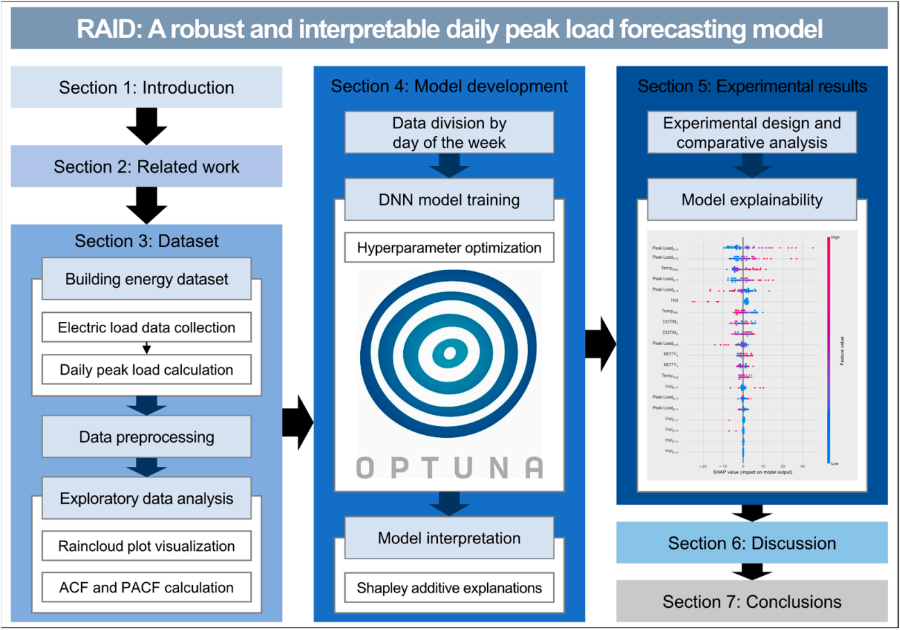

# 👨🏼‍🎓 Deep Learning Project
## Title
> **RAID: Robust and Interpretable Daily Peak Load Forecasting via Multiple Deep Neural Networks and Shapley Values**  
> - 2022년 학부 수업 프로젝트 (학부 3학년)
> - Published : 2023.04.20

## Abstract
Accurate daily peak load forecasting (DPLF) is crucial for informed decision-making in energy management. Deep neural networks (DNNs) are particularly apt for DPLF because they can analyze multiple factors, such as timestamps, weather conditions, and historical electric loads. Interpretability of machine learning models is essential for ensuring stakeholders understand and trust the decision-making process. We proposed the RAID (robust and interpretable DPLF) model, which enhances DPLF accuracy by recognizing daily peak load patterns and building separate DNN models for each day of the week. This approach was accessible for energy providers with limited computational resources, as the DNN models could be configured without a graphics processing unit (GPU). We utilized scikit-learn’s MLPRegressor for streamlined implementation, Optuna for hyperparameter optimization, and the Shapley additive explanations (SHAP) method to ensure interpretability. Applied to a dataset from two commercial office buildings in Richland, Washington, RAID outperformed existing methods like recurrent neural networks, Cubist, and HYTREM, achieving the lowest mean absolute percentage error values: 14.67% for Building 1 and 12.74% for Building 2. The kernel SHAP method revealed the influence of the previous day’s peak load and temperature-related variables on the prediction. The RAID model substantially improved energy management through enhanced DPLF accuracy, outperforming competing methods, providing a GPU-free configuration, and ensuring interpretable decision-making, with the potential to influence energy providers’ choices and promote overall energy system sustainability.

